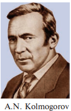


<!-- # Content Will be Added Soon -->
## Probability  
### Classical definition (A priori) of probability (Bernoulli’s principle of equally likely)  
>Priori : Knowledge which precedes from theoretical deduction or making assumption. Not from experience or observation

Earlier classes we have studied the frequency (A posteriori) 
definition of probability and the problems were solved. Now 
let us learn the fundamentals of the axiomatic approach to 
probability theory    
>Posteriori :
Knowledge which 
precedes from 
experience or 
observation

The basic assumption of underlying the classical theory is that the outcomes of a random 
experiment are equally likely. If there are \\(n\\) exhaustive, mutually exclusive and equally likely 
outcomes of an experiment and \\(m\\) of them are favorable to an event \\(A\\), then the mathematical
probability of A is defined as the ratio \\(\frac m n\\)
. In other words, \\(P(A)=\frac m n\\).

___
**Definition 12.13**  
Let \\(S\\) be the sample space associated with a random experiment and \\(A\\) be an event. Let \\(n(S)\\) 
and \\(n(A)\\) be the number of elements of \\(S\\) and \\(A\\) respectively. Then the probability of the event \\(A\\)
is defined as  
\\(P(A) = \frac n(A) n(S) =  \frac {Number of cases favorable to A}{Number of cases favorable to S}\\)
___

**Every probabilistic model involves an underlying process is shown in the following figure.**  
  
The classical definition of probability is limited in its application only to situations where there are 
a finite number of possible outcomes. It mainly considered discrete events and its methods were mainly 
combinatorial. This renders it inapplicable to some important random experiments, such as ‘tossing a coin 
until a head appears’ which give rise to the possibility of infinite set of outcomes. Another limitation of the 
classical definition was the condition that each possible outcome is ‘equally likely’. 

These types of limitations in the classical definition of probability led to the evolution of the 
modern definition of probability which is based on the concept of sets. It is known an axiomatic 
approach.

  
The foundations of the Modern Probability theory were laid by Andrey 
Nikolayevich Kolmogorov, a Russian mathematician who combined the notion 
of sample space introduced by Richard von Mises, and measure theory and 
presented his axiomatic system for probability theory in 1933. We introduce the 
axiomatic approach proposed by A.N. Kolmogorov. Based on this, it is possible to 
construct a logically perfect structure of the modern theory of probability theory. 
The classical theory of probability is a particular case of axiomatic probability. 
The axioms are a set of rules, which can be used to prove theorems of probability.

### Axiomatic approach to Probability  
___
**Axioms of probability**  
Let \\(S\\) be a finite sample space, let \\(P(S)\\) be the class of events, and let \\(P\\) be a real valued 
function defined on \\(P(S)\\) . Then \\(P(A)\\) is called probability function of the event \\(A\\) , when the 
following axioms are hold:  
[P1] For any event A,&emsp;&emsp;&emsp;&emsp;&emsp;&emsp;&emsp; \\(P(A) \geqslant 0\\) &emsp;&emsp;&emsp;&emsp;&emsp;&emsp;&emsp;(Non-negativity axiom)  
[P2]  For any two mutually exclusive events,&emsp;&emsp;&emsp;\\(P(A \cup B) = P(A) + P(B)\\)&emsp;&emsp;&emsp;&emsp;(Additivity axiom)  
[P3] For the certain event&emsp;&emsp;&emsp;&emsp;&emsp;&emsp;&emsp;\\(P(S)\\) = 1&emsp;&emsp;&emsp;&emsp;&emsp;&emsp;(Normalization axiom)
___

**Note 12.1**  
(i) \\(0 \leqslant P(A) \leqslant 1\\)  
(ii) If \\( A_{1}, A_{2}, A_{3},.....A_{n} \\) are mutually exclusive events in a sample space S, then \\(P(A_{1}\cup A_{2} \cup A_{3} \cup .... A_{n}) = P(A_{1}) + P(A_{2}) + P(A_{3}) + .... +P(A_{n})\\)

**Theorems on finite probability spaces (without proof)**  
When the outcomes are equally likely Theorem 12.1 is applicable, else Theorem 12.2 is applicable.  
**Theorem 12.1**  
Let \\(S\\) be a sample space and for any subset \\(A\\) of \\(S\\), let \\(P(A) = \frac {n(A)} {n(S)}\\). Then \\(P(A)\\) satisfies axioms
of probability [P1], [P2] and [P3].  
**Theorem 12.2**  
Let \\(S\\) be a finite sample space say \\(S = \{a_{1},a_{2},a_{3},.....,a_{n}\}\\). A finite probability space is obtained
by assigning to each point \\(a_{i}\\) in \\(S\\) a real number \\(p_{i}\\), is called the probability of \\(a_{i}\\) , satisfying the
following properties:  
(i) Each \\(p_{i} \geqslant 0\\). &emsp;&emsp; (ii) The sum of the \\(p_{i}\\) is 1, that is \\(\sum p_{i} = p_{1} + p_{2} + p_{3} + .... + p_{n} = 1\\)  
If the probability \\(P(A)\\), of an event \\(A\\) is defined as the sum of the probabilities of the points in \\(A\\) ,
then the function \\(P(A)\\) satisfies the axioms of probability [P1], [P2] and [P3].  
Note: Sometimes the points in a finite sample space and their assigned probabilities are given 
in the form of a table as follows:  
|   |   |
|  --- |  --- | 
| Outcome  | \\(a_{1},a_{2},a_{3},.....,a_{n}\\)  |
| Probability  | \\(p_{1},p_{2},p_{3},.....,p_{n}\\)  |

Here is an illustration of how to construct a probability law starting from some common sense 
assumptions about a model.   
**Illustration 12.6**  
(1) Let \\(S\\) = {1,2,3} Suppose _P_\\((S)\\) is the power set of \\(S\\), and \\(P(A) = \frac {n(A)} {n(S)}\\). Then \\(P(\{1}) = \frac 1 3, P(\{2}) = \frac 1 3,P(\{3}) = \frac 1 3\\),
satisfies axioms of probability [P1], [P2] and [P3]. Here all the outcomes are equally likely.  
(2) Let \\(S\\) = {1,2,3} .Suppose _P_\\((S)\\) is the power set of \\(S\\),  
If the probability \\(P(S)\\), of an event \\(A\\) of \\(S\\) is defined as the sum of the probabilities of the 
points in \\(A\\) , 
 then \\(P(\{1}) = \frac 1 2, P(\{2}) = \frac 1 4,P(\{3}) = \frac 1 4\\),
satisfy the axioms of probability [P1], [P2] and [P3].   
(3) Let \\(S\\) = {1,2,3} and _P_\\((S)\\) is the power set of \\(S\\) . If the probability \\(P(A)\\), of an event \\(A\\) of 
\\(S\\) is defined as the sum of the probabilities of the points in \\(A\\) ,  
then \\(P(\{1}) = 0, P(\{2}) = \frac 1 {\sqrt2},P(\{3}) = 1-{\frac 1 {\sqrt2}}\\)
 
satisfy the above axioms [P1], [P2] and [P3].  
In (2) and (3), the outcomes are not equally likely

**Note 12.2**  
Irrational numbers also can act as probabilities.  
___
Classroom Activity: Each student to flip a coin 10 times, 
Calculate: \\(P = \frac {Number of times head occur} {10}\\)  
Find the cumulative ratio of heads to tosses. As number of tosses increases \\(p \rightarrow \frac 1 2\\)
___

___
**Example 12.1**  
If an experiment has exactly the three possible mutually exclusive outcomes \\(A\\), \\(B\\), and \\(C\\), 
check in each case whether the assignment of probability is permissible   
(i) \\(P(\{A}) = \frac 4 7,&emsp;&emsp; P(\{B}) = \frac 1 7, &emsp;&emsp;P(\{C}) = \frac 2 7\\)  
(ii) \\(P(\{A}) = \frac 2 5,&emsp;&emsp; P(\{B}) = \frac 1 5, &emsp;&emsp;P(\{C}) = \frac 3 5\\)  
(iii) \\(P(\{A}) = 0.3,&emsp;&emsp; P(\{B}) = 0.9, &emsp;&emsp;P(\{C}) = -0.2\\)  
(iv) \\(P(\{A}) = \frac 1 {\sqrt3},&emsp;&emsp; P(\{B}) = 1-{\frac 1 {\sqrt3}}, &emsp;&emsp;P(\{C}) = 0\\)  
(v) \\(P(\{A}) = 0.421,&emsp;&emsp; P(\{B}) = 0.527, &emsp;&emsp;P(\{C}) = 0.042\\)  
**Solution**  
Since the experiment has exactly the three possible mutually exclusive outcomes \\(P(A)\\), \\(P(B)\\)
and \\(P(C)\\), they must be exhaustive events.
 ⇒\\(P(S)\\)=\\(P(A)\\)∪\\(P(B)\\)∪\\(P(C)\\)
Therefore, by axioms of probability   
\\(P(A) ≥ 0, P(B) ≥ 0, P(C) ≥ 0\\) and  
\\(P(A ∪ B ∪ C) = P(A) + P(B) + P(C) = P(S) =1 \\)  
(i) Given that \\(P(A) = \frac 4 7 \geqslant 0, P(B) = \frac 1 7 \geqslant 0\\) and \\(P(C) = \frac 2 7 \geqslant 0\\)   
Also \\(P(S)\\)=\\(P(A)\\)+\\(P(B)\\)+\\(P(C)\\) = \\(\frac 4 7 + \frac 1 7 + \frac 2 7 = 1\\)  
Therefore the assignment of probability is permissible  
(ii) Given that \\(P(A) = \frac 2 5 \geqslant 0, P(B) = \frac 1 5 \geqslant 0\\) and \\(P(A) = \frac 3 5 \geqslant 0\\)  
But \\(P(S)\\)=\\(P(A)\\)+\\(P(B)\\)+\\(P(C)\\) = \\(\frac 2 5 + \frac 1 5 + \frac 3 5 = 6 > 1\\)  
Therefore the assignment is not permissible.  
(iii) Since \\(P(A)\\) = -0.2 is negative, the assignment is not permissible.  
(iv) The assignment is permissible because  
\\(P(A) = \frac 4 {\sqrt3} \geqslant 0, P(B) = 1-{\frac 1 {\sqrt3}} \geqslant 0\\) and \\(P(C) = 0 \geqslant 0\\)  
\\(P(S)\\)=\\(P(A)\\)+\\(P(B)\\)+\\(P(C)\\) = \\(\frac 1 {\sqrt3} + 1 -\frac 1 {\sqrt3} + 0 = 1\\).  
(v) Even though \\(P(A) = 0.421 \geqslant 0, P(B) = 0.527 \geqslant 0\\) and \\(P(C) = 0.042 \geqslant 0\\) the sum of the probability
\\(P(S)\\)=\\(P(A)\\)+\\(P(B)\\)+\\(P(C)\\) = \\(0.421 + 0.527 + 0.042 < 1\\).  
Therefore, the assignment is not permissible.
___

___
**Example 12.2**  
An integer is chosen at random from the first ten positive integers. Find the probability 
that it is (i) an even number (ii) multiple of three.  
**Solution**  
The sample space is  
\\(S\\) = {1, 2, 3, 4, 5, 6, 7, 8, 9, 10} , \\(n(S)\\) = 10
Let \\(A\\) be the event of choosing an even number and 
\\(B\\) be the event of choosing an integer multiple of three.  
\\(A\\) = {2, 4, 6, 8, 10}, \\(n(A)\\) = 5,   
\\(B\\) = {3, 6, 9}, \\(n(B)\\) = 3  
\\(P\\)(choosing an even integer) = \\(P(A) = \frac {n(A)} {n(S)} = \frac 5 {10} = \frac 1 2\\).  
\\(P\\)(choosing an even multiple of three) = \\(P(B) = \frac {n(B)} {n(S)} = \frac 3 {10}\\).
___  

___
**Example 12.3**  
Three coins are tossed simultaneously, what is the probability of getting (i) exactly one head 
(ii) at least one head (iii) at most one head?  
**Solution:**  
Notice that three coins are tossed simultaneously = one coin is tossed three times.  
The sample space \\(S\\) = {\\(H,T\\)} × {\\(H,T\\)} × {\\(H,T\\)}  
\\(S\\) = {\\(HHH, HHT, HTH, THH, HTT, THT, TTH, TTT\\)}, \\(n(S)\\) = 8  
Let \\(A\\) be the event of getting exactly one head, \\(B\\) be the event of getting atleast one head and 
\\(C\\) be the event of getting at most one head.  
\\(A\\) = {\\(HTT, THT, TTH\\)} ; \\(n(A)\\) = 3  
 \\(B\\) = {\\(HTT, THT, TTH, HHT, HTH, THH, HHH\\)} H n ; \\(n(B)\\) = 7  
 \\(C\\) = {\\(TTT, HTT, THT, TTH\\)}; \\(n(C)\\) = 4 .  
 Therefore the required probabilities are   
 (i) \\(P(A) = \frac {n(A)} {n(S)} = \frac 3 8\\)  
 (ii) \\(P(B) = \frac {n(B)} {n(S)} = \frac 7 8\\)  
 (iii) \\(P(C) = \frac {n(C)} {n(S)} = \frac 4 8 = \frac 1 2\\) 
 ___

**Note 12.3**  

When the number of elements in a sample space is considerably 
small we can solve by finger-counting the elements in the events. But 
when the number of elements is too large to count then combinatorics 
helps us to solve the problems.
For the following problem, combinatorics is used to find the 
number of elements in the sample space and the events. 

