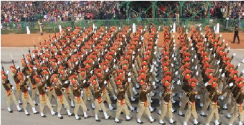

# Introduction
The beginnings of matrices and determinants go back to the second century BC although traces can be seen back to the fourth century BC. However, it was not until near the end of the seventeenth century that the ideas reappeared and development really got underway. It is not surprising that the beginnings of matrices and determinants should arise through the study of systems of linear equations. The Babylonians studied problems which lead to simultaneous linear equations and some of these are preserved in clay tablets which survive till now.

The evolution of the theory of ‘*matrices*’ is the result of attempts to obtain compact and simple methods for solving systems of linear equations. It also began with the study of transformations of geometric objects. In 1850, it was *James Joseph Sylvester* an English Mathematician and lawyer, coined the word ‘*Matrix*’ (originally from Latin: Ma ter means Mother - Collin’s Dictionary). Matrices are now one of the most powerful tools in mathematics.

Generally, a matrix is nothing but a rectangular array of objects. These matrices can be visualised in day-to-day applications where we use matrices to represent a military parade or a school assembly or vegetation.

The term ‘*determinant*’ was first coined by *Carl F Gauss* in *Disquisitiones arithmeticae* (1801) while studying quadratic forms. But the concept is not the same as that of modern day determinant. In the same work Gauss laid out the coefficients of his quadratic forms in rectangular arrays where he described matrix multiplication.

It was Cauchy (in 1812) who used *determinant* in its modern sense and studied it in detail. He reproved the earlier results and gave new results of his own on minors and adjoints. It was *Arthur Cayley* whose major contribution was in developing the algebra of matrices and also published the theory of determinants in 1841. In that paper he used two vertical lines on either side of the array to denote the determinant, a notation which has now become standard. In 1858, he published *Memoir on the theory of matrices* which was remarkable for containing the first abstract definition of a matrix. He showed that the coefficient arrays studied earlier for quadratic forms and for linear transformations were special cases of his general concept. They simplify our work to a great extent when compared with other straight forward methods which would involve tedious computation. The mathematicians *James Joseph Sylvester* (1814 – 1897), *William Rowan Hamilton* (1805 – 1865), and *Arthur Cayley* (1821 – 1895) played important roles in the development of matrix theory. English mathematician *Cullis* was the first to use modern bracket notation for matrices in 1913. The knowledge of matrices is absolutely necessary not only within the branches of mathematics but also in other areas of science, genetics, economics, sociology, modern psychology and industrial management.

Matrices are also useful for representing coefficients in systems of linear equations. Matrix notations and operations are used in electronic spreadsheet programs on computers, which in turn are used in different areas of business like budgeting, sales projection, cost estimation, and in science, for analyzing the results of an experiment etc.

Interestingly, many geometric operations such as magnification, rotation and reflection through a plane can also be represented mathematically by matrices. Economists use matrices for social accounting, input-output tables and in the study of inter-industry economics. Matrices are also used in communication theory and network analysis in electrical engineering. They are also used in *Cryptography*.

In this chapter, we now first discuss matrices and their various properties. Then we continue to study determinants, basic properties, minors and their cofactors. Here we now restrict the discussion up to determinants of order 3 only.

**Learning Objectives**

On completion of this chapter, the students are expected to
* visualise difficult problems in a simple manner in terms of matrices.
* understand different types of matrices and algebra of matrices.
* compute determinant values through expansion and using properties of determinants.
* apply the concepts of matrices and determinants to find the area of a triangle and collinearity of three points.