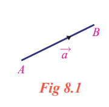



## Representation of a vector and types of vectors

A vector has a tail and a tip. Consider the diagram as in Fig. 8.1.

---
**Definition 8.3**

The tail point A is called the initial point and the tip point B is called the terminal point of the vector \\(\overrightarrow{a}\\). The initial point of a vector is also taken as origin of the vector.

---

The initial point A of the vector \\(\overrightarrow{a}\\) is the original position of a point and the terminal point B is its position after the translation.

The length or magnitude of the vector \\(\overrightarrow{a}\\) is the length of the line segment AB and is denoted by |\\(\overrightarrow{a}\\)|.

The undirected line AB is called the support of the vector \\(\overrightarrow{a}\\). 

To distinguish between an ordinary line segment without a direction and a line segment representing a vector, we make an arrow mark for the vector as\\(\overrightarrow{AB}\\) and \\(\overrightarrow{a}\\). So AB denotes the line segment.

---
**Definition 8.4**

If we have a liberty to choose the origin of the vector at any point then it is said to be free vector, whereas if it is restricted to a certain specified point then the vector is said to be localized vector.

---

Upto vector product we will be dealing with free vectors only. Localised vectors are involved in finding equations of straight lines.

---
**Definition 8.5**

Co-initial vectors are having the same initial point. On the other hand, the co-terminous
vectors are having the same terminal point.

---

---
**Definition 8.6**

Two or more vectors are said to be collinear or parallel if they have same line of action or have
the lines of action parallel to one another.

Two or more vectors are said to be coplanar if they lie on the same plane or parallel to the same
plane.

---

---
**Definition 8.7**

Two vectors are said to be equal if they have same direction and same magnitude.

---

 
 Let us note that it is not necessary to have the same initial point and same 
terminal point for two equal vectors. For instance, in Fig. 8.2, the vectors \\(\overrightarrow{b}\\)and \\(\overrightarrow{c}\\) are equal since they have same direction and same length, whereas \\(\overrightarrow{a}\\) and \\(\overrightarrow{a}\\) are not equal because of opposite direction even though they are having same length. The vectors \\(\overrightarrow{c}\\) and \\(\overrightarrow{d}\\) are not equal even though they are having same direction but not having same length.

---
**Definition 8.8**

Zero vector is a vector which has zero magnitude and an arbitrary direction and it is 
denoted by \\(\overrightarrow{0}\\).

---

That is, a vector whose initial and terminal points are coincident is called a zero vector.
We observe that the initial and terminal points of a zero vector are the same. The zero vector is also called null vector or void vector.
A vector of magnitude 1 is called a unit vector. The unit vector in the direction of \\(\overrightarrow{a}\\) is denoted by\\(\^{a}\\) (read as ‘a cap’ or ‘a hat’). Clearly | | aˆ = 1.
We observe that there are infinitely many directions and hence there are infinitely many unit vectors. In fact, for each direction there is one unit vector in that direction. 
Any non-zero vector \\(\overrightarrow{a}\\) can be written as the scalar multiple of a unit vector in the direction of \\(\overrightarrow{a}\\) . This scalar is nothing but the magnitude of the vector. 
Thus for any vector \\(\overrightarrow{a}\\)= |\\(\overrightarrow{0}\\)| a^ , where aˆ is the unit vector along the direction of \\(\overrightarrow{a}\\) .Clearly ˆa= |\\(\frac{\overrightarrow{a}}{|\overrightarrow{a}|}\\)for any non-zero vector.

---
**Definition 8.9**
Two vectors are said to be like vectors if they have the same direction. Two vectors are said to 
be unlike vectors if they have opposite directions.

---

We observe that if two vectors are like vectors or unlike vectors, then the undirected lines (support) 
of the vectors are parallel to each other. There are pair of vectors which are neither like nor unlike vectors.

